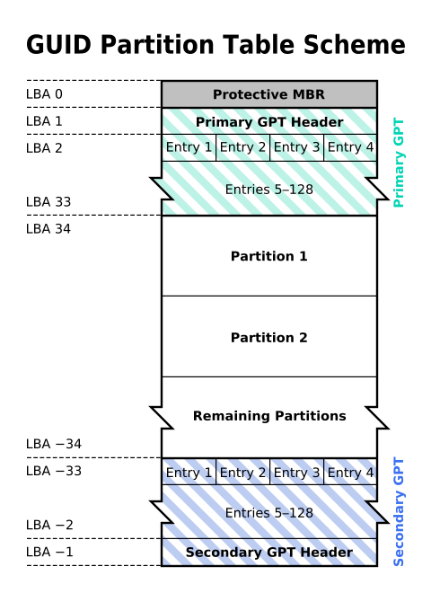

在LInux中，有一种特殊的系统备份技术，因为Linux的特殊启动模式和结构，我们可以使用手动方法方便的完成全盘备份，这篇博客就是关于此技术的记录。

===

# Linux 手动完全备份技术
在LInux中，有一种特殊的系统备份技术，因为Linux的特殊启动模式和结构，我们可以使用手动方法方便的完成全盘备份，这篇博客就是关于此技术的记录。

## 测试操作系统

我们使用此操作系统来进行此技术测试操作：Ubuntu 24.04 LTS

## 备份Rootfs系统

执行以下命令可以复制`Linux`的Rootfs.

```
mkdir bak
cd bak
tar -cvpzf rootfs.tar.gz --hard-dereference --dereference --acls --xattrs --one-file-system --exclude $PWD /
```

以下是参数表含义:

| 参数 | 含义 |
|:---:|:---:|
|-c|创建一个新归档|
|-v|输出详细信息|
|-p|保留权限|
|-z|通过 gzip 过滤归档|
|-f|使用归档文件或 ARCHIVE 设备|
|--hard-dereference|追踪硬链接，由于这是系统备份，所以需要保留所有链接关系和数据，这是可选的|
|--dereference|追踪软链接，需要保留所有数据和链接关系，防止恢复失败，这是可选的|
|--acls|保留ACLS权限|
|--xattrs|保留扩展权限位|
|--one-file-system|单文件系统归档，这对于我们的系统rootfs备份是非常重要的参数|
|--exclude|例外目录设置|

## 备份分区表

执行以下命令来以文本方式备份GPT分区表(其实也包括传统分区表)：
```
sfdisk --dump /dev/vda > gpt_tables.txt
```

/dev/vda: 这是磁盘分区表所在设备，也就是你的磁盘。

这里有几行重要数据：
```
first-lba: 34
last-lba: 209715166
sector-size: 512
```

这为二进制备份提供了帮助

分区表布局



根据表和`sfdisk`信息，备份gpt起始表

```
dd if=/dev/vda of=gpt-first.bin skip=1 bs=512 count=32 status=progress
```

备份gpt备份表

```
dd if=/dev/vda of=gpt-second.bin skip=209715168 bs=512 count=32 status=progress
```

## 备份MBR

MBR位于磁盘LBA 0的地方，所以命令是：

```
dd if=/dev/vda of=mbr.bin skip=0 bs=512 count=1 status=progress
```

## 完成

到现在，我们的备份工作完成，接下来是将其压缩和归档

```
mkisofs -J  -udf  -v  -udf  -iso-level 3 -allow-limited-size -o bak.iso bak
tar -acvf bak.tar.gz bak
```
